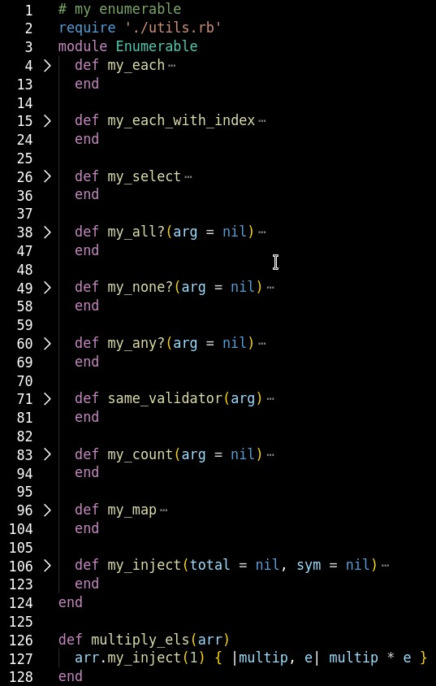

# Building Blocks-My Enumerables
## Table Of Contents

* [About the project](#about-the-project)
* [Technologies](#technologies)
* [Acknowledgements](#acknowledgements)
* [About Me](#about-me)

## About the project

This Program was built by me Ara CE.
## Technologies
<!--Add more technologies HERE-->
The technologies I used were Github, VSCode, Ruby, Rubocop, Rubocop Linter, Zeal Libraries, Youtube, Codeacademy.

## Acknowledgements

* Jesus Castello Youtube Channel [Link Here](https://www.youtube.com/channel/UCUCRO4CMJQgoabub5SzJQug)
* Jesus Castello's Ruby Guides [Link Here](https://www.rubyguides.com/)
* Free Code Camp's Ruby Programming Language Full Course [Link Here](https://www.youtube.com/watch?v=t_ispmWmdjY&t=9502s)
* Learn Enough to Be Dangerous Ruby Course [Linkd Here](https://www.learnenough.com/)
* Zeal Ruby Library [Link Here](https://zealdocs.org/)
* The Odin Project Specs [Link Here](https://www.theodinproject.com/courses/ruby-programming/lessons/advanced-building-blocks)
* Ruby Docs [Link Here](https://ruby-doc.org/core-2.7.0/Enumerable.html)
* Codeacademy Ruby Course[Link Here](https://www.codecademy.com/learn)

I would also like to acknoweldge the help I received from my Microverse friends and coding partner, for your extra time, amazing patience, cheering me on, and all those tutoring sessions to help me understand. Thank you.

## About me

MY GITHUB PROFILE
* Ara Camarillo - [Link](https://github.com/aracelicaes)

MY LINKEDIN PROFILE
* Ara Camarillo - [Link](https://www.linkedin.com/in/ara-camarillo-7297799b/)
